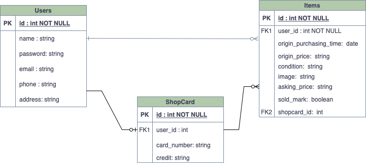
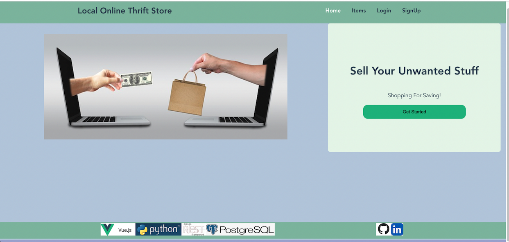
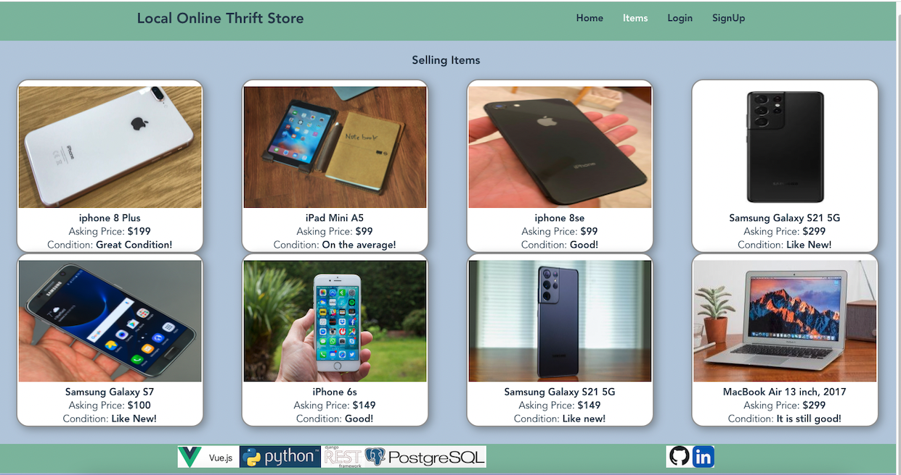

# OnlineThriftShop

#### Date: 2/7/2022

#### Due: 2/14/2022

#### By: Jane Mingzhen Wang

#### [Linkedin](https://www.linkedin.com/in/janemzwangnj)|[GitHub](https://github.com/janemzwangnj/onlineThriftShop)|[Website](https://jane-thriftshop.surge.sh/)|[Trello](https://trello.com/b/ckEhoG2u/onlinethriftshop)

---

## _Description_

The project of online thrift shop is trying to build a website for a local community, like people in a same city, or students in a college or university, to sell the items they don't like anymore but reusable for others.

The website lets people sign up as a customer of APP to sell their old items and buy the other's items. The sign-in customers are able to post the selling items and also search their available items to mark the items they want. Then they can finish the shop transaction locally by commucating through the phone or email.

The application will be implemented with a Vue frontend, a Python/Django backend, and Postgres database.

---

## _Technologies Used_

- Vue.js 
- Python3 
- Django 
- Django Rest Framework 
- Postgres 

---

## _Getting Started_

I started with Whimsical to map out componenents heriarchy diagram(CHD) for the frontend. This will give me ideas which components need to create and how the components are liked. Then using Drawio, I draw the entity relationship diagram (ERD) to create the models which are needed in the database for the backend. The last step before the coding was to create a Trello board to detail each steps needed on the frontend, the backend and the eventual styling.

Component Heriarchy Diagram(CHD):

Entity Relationship Diagram(ERD):

[Trello](https://trello.com/b/ckEhoG2u/onlinethriftshop)

Screenshots

---

## _Future Updated_

- Customer authentication
- Add oneline payment
- Add shipping component
- Trading history and customer reivews

---

## _Resourcses_

- [The Heroku CLI](https://devcenter.heroku.com/articles/heroku-cli)
- [Deploying Django](https://github.com/SEI-R-11-8/deploying-django)
- [Deploying Vue App with Surge](https://udemezue.medium.com/how-to-deploy-a-vue-js-application-with-surge-86614220392c)
